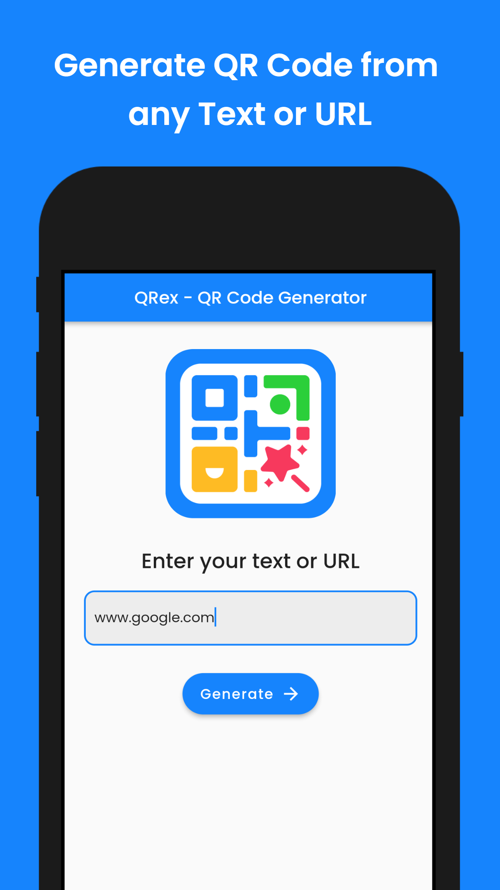
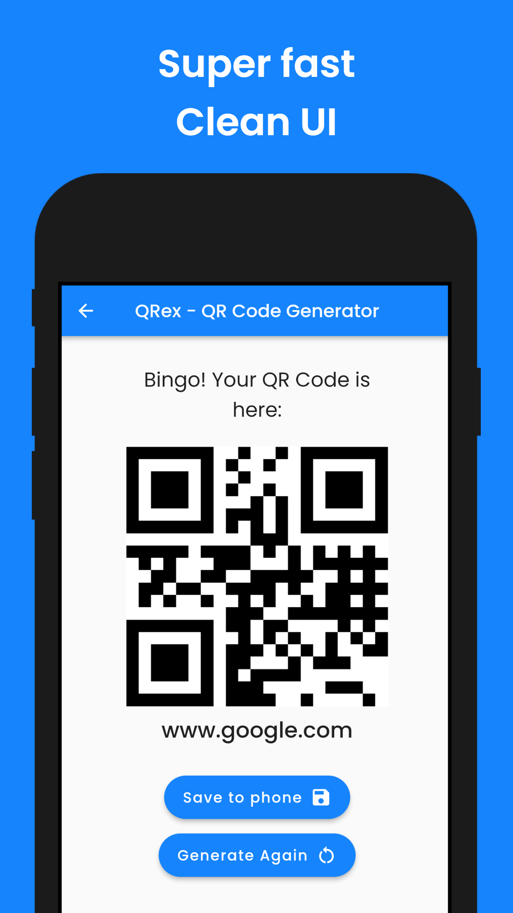

# QRex - QR Code Generator

An app for generating QR Codes from texts and URLs.

## Features

 - Generate QR Code of any Text or URL
 - Works super fast & consistant
 - Save QR Codes in your device as image
 - Image Caching saves your data & loads instantly
 - Clean & Modern User Interface
 - Availabe for both Android & IOS

## Screenshots

<!-- 

 -->

## Try out QRex?

Android: [Download QRex.apk](https://www.goggle.com)

## Developer

Hi there! I am Afjal Al Sayed. I create Android apps for solving problems and to make things easier. Try out my new app QRex - QR Code Generator. If you have any query related to it don't hasitate to [e-mail me](mailto:sayed01851@gmail.com). And also check out my other stuffs [here](kjad).

## Credits

[goqr.me](https://goqr.me/api/) helps us providing images of QR Code.    <i><small>Note that these external sites are not operated by us. Therefore, we strongly advise you to review the Privacy Policy of these websites. We have no control over and assume no responsibility for the content, privacy policies, or practices of any third-party sites or services.</small></i>

## Copyright

All rights reserved by Afjal Al Sayed. Copyright &copy; 2022.
